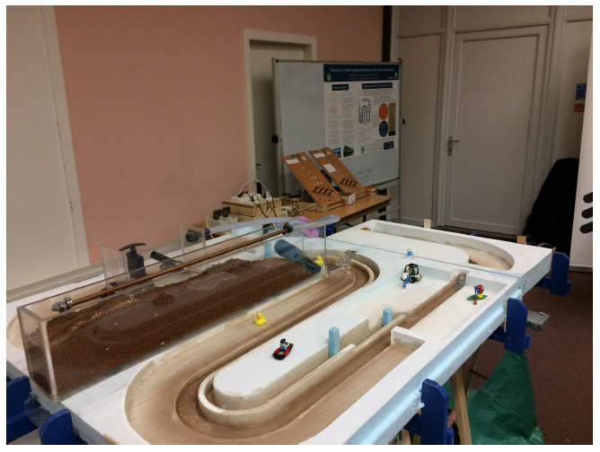
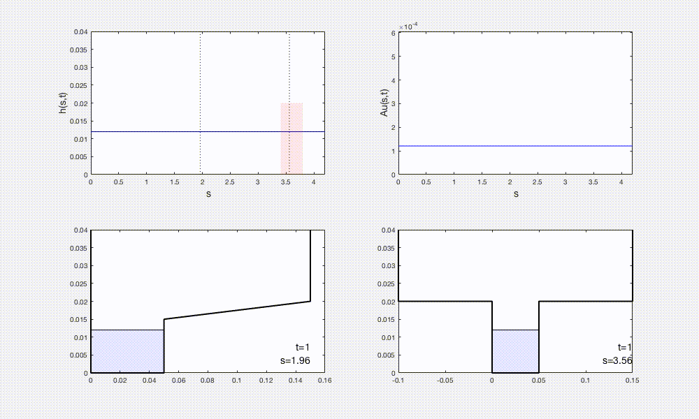

# hydraulic_wetro

## Hydraulic modelling of the flood and rainfall demonstrator Wetropolis


This repository contains the source code and documentation on the numerical modelling of Wetropolis. In Bokhove et al. (2020), a numerical model (based on the equations for open channel flow under the kinematic assumption) is used to determine the relevant time and length scales prior to its construction as a physical model -- see the [Wetropolis' design and showcase Github page](https://github.com/obokhove/wetropolis20162020/) for more info. The original numerical model is crude and inexpensive, suitable for design purposes but unsuitable as a predictive model. **This page tracks the further development of the hydrodynamic modelling, both mathematically and numerically, with a view to conducting Wetropolis-inspired experiments in flood mitigation and control.** See [taster](#taster) for an illustrative movie.

---
## Contents

* [Introduction](#introduction)
  * [Motivation](#motivation)
  * [Description](#A-brief-description-of-Wetropolis)
  * [Taster](#taster)
  * [References](#references)
* [Getting started](#getting-started)
* [Code overview](#files--overview)
  * [MATLAB](#matlab)
  * [Python](#python)

---

## Introduction
### Motivation
Urban flooding is a major hazard worldwide, brought about by intense rainfall and often exacerbated by the built environment. The tabletop flood-demonstrator Wetropolis illustrates in an idealised modelling environment how extreme hydroclimatic events can cause flooding of a city due to peaks in river levels and groundwater following intense rainfall. It aims to conceptualise the science of flooding in a way that is accessible to and directly engages the public and also provides a scientific testbed for flood modelling, control and mitigation, and data assimilation. As such, it is useful to the scientist, industrial practitioner, and general public.

### A brief description of Wetropolis
Physically, it comprises a winding river channel with parallel canal, a reservoir for water storage, a porous flow cell (analogous to a moor) with observable groundwater flow, and random rainfall, which may or may not lead to flooding in the idealised urban area of Wetropolis. The main river channel has three $\pi$--degree bends and one $(\pi/4)$--degree bend and is fed by water flowing into the domain at an upstream entry and leaving the domain at the downstream exit. The river bed is sloping down (uniformly with gradient 1 in 100); the river cross-sectional area is rectangular and uniform, and flanked on one side by a sloping flood plain outside of the urban area. Through the urban area, the rectangular channel is flanked on both sides by flat rectangular plains of higher elevation than the regular river channel, i.e., the cross-sectional area is T-shaped. Water enters the main channel in three places: (i) the upstream inflow, generally kept constant; (ii) overflow of a groundwater cell (or "moor") with porous material and fed by random daily rainfall; and (iii) overflow from a reservoir, also fed by random daily rainfall. The two overflows can be placed in three different spots along the river: upstream, midstream or downstream just before the city plain. The set-up is displayed in plan-view (below left) and in action at a meeting of the Churchtown Flood Action Group (below right).

Rainfall is supplied randomly in space at four locations (reservoir, moor, reservoir and moor, or nowhere) and randomly in time at four rainfall amounts (1s, 2s, 4s, or 9s) during a 10s Wetropolis day (wd) via two skew-symmetric discrete probability distributions. The joint probabilities (rain amount times rain location) are determined daily as one of 16 possible outcomes from two asymmetric Galton boards, in which steel balls fall down every wd and according to the (imposed) discrete probability distributions. The most extreme daily rainfall event thus involves 9s rainfall on both moor and reservoir. Its design is based on simulations of a one-dimensional numerical model of the dynamics that uses a kinematic approximation to describe the river flow and a depth-averaged nonlinear diffusion equation for the groundwater cell; a stochastic rainfall generator determines the amount and location of rain per wd.  In order to create an extreme flood event in Wetropolis once every 5 to 10 minutes on average instead of, say, once every $100$ to $200$ years on average (as in reality), this preliminary modelling determined the length of the Wetropolis day to be 10s. Thus, Wetropolis is able to demonstrate random extreme rainfall and flood events in a physical model on reduced spatial and temporal scales (see Bokhove et al. (2020) for more details).

Plan view            |  In action
:-------------------------:|:-------------------------:
  |  


### Taster
*Preliminary test:* set up the channel geometry, initialised with a constant depth and kinematic velocity. The time-dependent left boundary sends a Gaussian pulse into the domain which travels down the channel and flood the plains and city area. This 'floodwave' passes out of the domain and river levels recede.



Top-left: depth h as a function of the along-channel coordinate s. The red shaded area denotes the city area. Top-right: Discharge Au along the channel s. Bottom-left: cross-sectional slice at s = 1.96 (floodplain; see vertical dashed line in top-left panel). Bottom-right: cross-sectional slice at s = 3.56 (city area; see second vertical dashed line in top-left panel).


### References
* Bokhove, 0., Hicks, T., Zweers, W. and Kent, T. (2019): Wetropolis extreme rainfall and flood demonstrator: from mathematical design to outreach. *Accepted: HESS*. Preprint on [EarthArXiv](https://eartharxiv.org/59ymk/) and open review/discussion at [HESSD](https://www.hydrol-earth-syst-sci-discuss.net/hess-2019-191/).

* See also presentations on [OB's page](https://github.com/obokhove/wetropolis20162020/):
  * [Oxford seminar 2016](https://github.com/obokhove/wetropolis20162020/blob/master/WetropolisO2016.pdf)
  * [EGU 2018 talk](https://github.com/obokhove/wetropolis20162020/blob/master/wetropolisegu2018.pdf)
  * [EGU 2019 poster](https://github.com/obokhove/wetropolis20162020/blob/master/WetropolisposterEGU2019p.pdf)

----

## Getting started
### Add Language, versions, etc.
The source code is written in ...

## Files overview
### MATLAB

File name                   |  Summary
:--------------------------:|:--------------------------:
```AuNCP_wetro0```          |  Main run file
```initial_cond_wetro```    | Func: Set up initial data (detailed within)
```NCPflux_Au```            | Func: numerical flux calculation for space discretisation
```xsec_Ahs```              | Func: cross-sections A as a function of h and s
```xsec_hAs```              | Func: cross-sections h as a function of A and s
```plots_xsecs```           | Plots cross-section functions
```plot_xsec_hAs```         | Func: for plotting model output


### Python

File name                   |  Summary
:--------------------------:|:--------------------------:
...                         | ...
