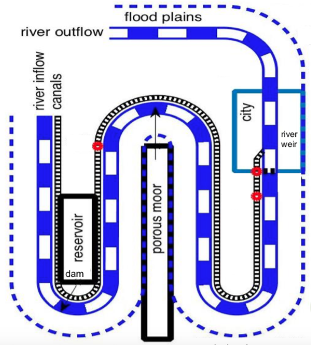
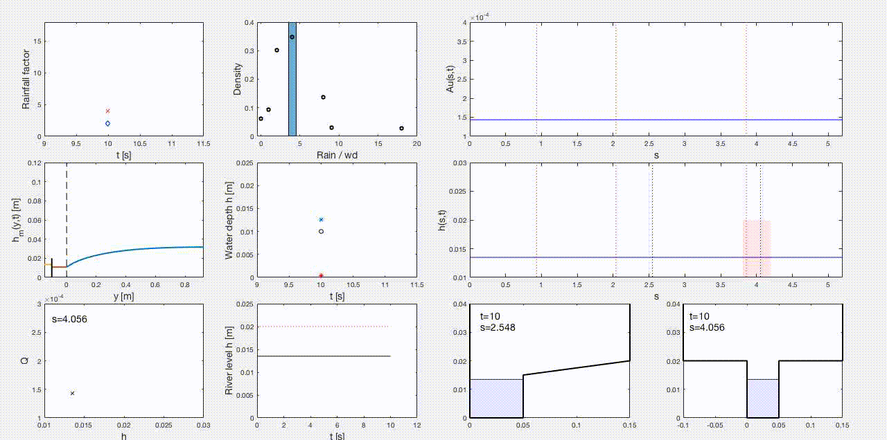

# hydraulic_wetro

## Wetropolis rainfall and flood demonstrator: developments in hydraulic modelling and visualisation

This repository contains the source code and documentation on the numerical modelling of Wetropolis. In Bokhove et al. (2020), a numerical model (based on the equations for open channel flow under the kinematic assumption) is used to determine the relevant time and length scales prior to its construction as a physical model -- see the [Wetropolis' design and showcase Github page](https://github.com/obokhove/wetropolis20162020/) for more info. The original numerical model is crude and inexpensive, suitable for design purposes but unsuitable as a predictive model. **This page tracks the further development of the numerical modelling and visualisation of Wetropolis, with a view to conducting experiments in data assimilation, flood mitigation, and control.** See [taster](#taster) for an illustrative movie.

---
## Contents

* [Introduction](#introduction)
  * [Motivation](#motivation)
  * [Description](#A-brief-description-of-Wetropolis)
  * [Taster](#taster)
  * [References](#references)
* [Getting started](#getting-started)
* [Code overview](#files-overview)
  * [MATLAB](#matlab)
  * [Python](#python)
* [Preliminary simulations](#preliminary-simulations)
---

## Introduction
### Motivation
Urban flooding is a major hazard worldwide, brought about by intense rainfall and often exacerbated by the built environment. The tabletop flood-demonstrator Wetropolis illustrates in an idealised modelling environment how extreme hydro-climatic events can cause flooding of a city due to peaks in river levels and groundwater following intense rainfall. It aims to conceptualise the science of flooding in a way that is accessible to and directly engages the public and also provides a scientific testbed for flood modelling, control and mitigation, and data assimilation. As such, it is useful to the scientist, industrial practitioner, and general public.

### A brief description of Wetropolis
Physically, it comprises a winding river channel with parallel canal, a reservoir for water storage, a porous flow cell (analogous to a moor) with observable groundwater flow, and random rainfall, which may or may not lead to flooding in the idealised urban area of Wetropolis. The main river channel has three \pi--degree bends and one (\pi/4)--degree bend and is fed by water flowing into the domain at an upstream entry and leaving the domain at the downstream exit. The river bed is sloping down (uniformly with gradient 1 in 100); the river cross-sectional area is rectangular and uniform, and flanked on one side by a sloping flood plain outside of the urban area. Through the urban area, the rectangular channel is flanked on both sides by flat rectangular plains of higher elevation than the regular river channel, i.e., the cross-sectional area is T-shaped. Water enters the main channel in three places: (i) the upstream inflow, generally kept constant; (ii) overflow of a groundwater cell (or "moor") with porous material and fed by random daily rainfall; and (iii) overflow from a reservoir, also fed by random daily rainfall. The two overflows can be placed in three different spots along the river: upstream, midstream or downstream just before the city plain. The set-up is displayed in plan-view (below left) and in action at Confluence 2018, Leeds (below right).

Plan view            |  In action
:-------------------------:|:-------------------------:
  |  

Rainfall is supplied randomly in space at four locations (reservoir, moor, reservoir and moor, or nowhere) and randomly in time at four rainfall amounts (1s, 2s, 4s, or 9s) during a 10s Wetropolis day (wd) via two skew-symmetric discrete probability distributions. The joint probabilities (rain amount times rain location) are determined daily as one of 16 possible outcomes from two asymmetric Galton boards, in which steel balls fall down every wd and according to the (imposed) discrete probability distributions. The most extreme daily rainfall event thus involves 9s rainfall on both moor and reservoir. The two asymmetric Galton boards are shown in action below.


Its design is based on simulations of a one-dimensional numerical model of the dynamics that uses a kinematic approximation to describe the river flow and a depth-averaged nonlinear diffusion equation for the groundwater cell; a stochastic rainfall generator determines the amount and location of rain per wd.  In order to create an extreme flood event in Wetropolis once every 5 to 10 minutes on average instead of, say, once every 100 to 200 years on average (as in reality), this preliminary modelling determined the length of the Wetropolis day to be 10s. Thus, Wetropolis is able to demonstrate random extreme rainfall and flood events in a physical model on reduced spatial and temporal scales (see Bokhove et al. (2020) for more details).

A working document with more background and theory, including the governing equations and numerics of Wetropolis, is found [here](Wetropolis_Au_model.pdf).


### Taster
*Preliminary test:* set up the channel geometry (see [pdf](Wetropolis_Au_model.pdf)), initialised with a constant depth and kinematic velocity. The time-dependent left boundary sends a Gaussian pulse into the domain which travels down the channel and floods the plains and city area. This 'floodwave' passes out of the domain and river levels recede. 


Top-left: water depth h as a function of the along-channel coordinate s. The red shaded area denotes the city area. Top-right: Discharge Au along the channel s. Bottom-left: cross-sectional slice at s = 1.96 (floodplain; see vertical dashed line in top-left panel). Bottom-right: cross-sectional slice at s = 3.56 (city area; see second vertical dashed line in top-left panel). Time [s] is indicated in the bottom panels; recall one 'Wetropolis day' [wd] is 10s. Channel length L = 4.21m. Simulation details: space-FV/DGFEM discretisation (Nk=105 elements) -- more details [here](Wetropolis_Au_model.pdf) -- and simple explicit forward Euler in time; run script ```AuNCP_wetro0.m```.


### References
* Bokhove, O., Hicks, T., Zweers, W., and Kent, T. (2020): Wetropolis extreme rainfall and flood demonstrator: from mathematical design to outreach, *Hydrol. Earth Syst. Sci.*, 24, 2483–2503, [DOI](https://doi.org/10.5194/hess-24-2483-2020).

* See also presentations on [OB's page](https://github.com/obokhove/wetropolis20162020/):
  * [Oxford seminar 2016](https://github.com/obokhove/wetropolis20162020/blob/master/WetropolisO2016.pdf)
  * [EGU 2018 talk](https://github.com/obokhove/wetropolis20162020/blob/master/wetropolisegu2018.pdf)
  * [EGU 2019 poster](https://github.com/obokhove/wetropolis20162020/blob/master/WetropolisposterEGU2019p.pdf)

----

## Getting started
### Add Language, versions, etc.
* MATLAB '9.4.0.813654 (R2018a)'
* Python '3.7.4' with:
  * Numpy '1.17.2'
  * Matplotlib '3.1.1'

## Files overview
### MATLAB

File name                   |  Summary
:--------------------------:|:--------------------------:
```AuNCP_wetro0.m```          |  Main run script for initial test case
```initial_cond_wetro.m```    | Func: Set up initial data (detailed within)
```NCPflux_Au.m```            | Func: numerical flux calculation for space discretisation
```xsec_Ahs.m```              | Func: cross-sections A as a function of h and s
```xsec_hAs.m```              | Func: cross-sections h as a function of A and s
```plots_xsecs.m```           | Plots cross-section functions
```plot_xsec_hAs.m```         | Func: for plotting model output
```run_wetro_2016.m```	| New ver of OB's original ```tabletop2v2016.m```
```run_wetro_2020.m```	| Run Wetropolis with updated St. Venant river system: first implementation working
```run_wetro_2020v2.m``` | Run Wetropolis with updated St. Venant river system: improvements
```live_plotting_routine.m``` | Separate plotting routine, called by ```run_wetro_2020v2.m```

### Python

File/dir name                   |  Summary
:--------------------------:|:--------------------------:
```main_wetro_run.py```         | Main run script for initial test case
```init_cond.py```              | Initial condition functions
```flux_function.py```          | Numerical flux calculation for space discretisation
```cross_sections.py```         | Compute cross-sections h(A,s) and A(h,s)
```plot_wetro.py```             | Plotting routine
```/configs```                  | Dir for config files
```/configs/config#1.py``` etc. | Config file containing parameters


## Preliminary simulations 
### Wetropolis: fully-coupled v1

#### Summary
First simulations of the St. Venant system for the river dynamics coupled to the other components of Wetropolis (see plan view above). Rainfall is supplied each wd at a random location (reservoir, moor, both, or nowhere) and rate (loosely-speaking 1, 2, 4, or 9s per wd). Separate reservoir and moor groundwater models describe the water level in these locations.The reservoir has an outflow directly into the river channel at s = s_res = 0.932m, and the moor has an outflow into the river channel and the canal at s = s_m = 2.038m *[see note below]* . The canal runs parallel to the river channel and has 3 sections connected by weirs (locks) and the water level in each section is constant in space. The final canal section flows into the river channel in the city region (s = s_c1 = 3.858m). Flooding occurs in the city region when the river levels exceed 0.02m. Initially, the moor, reservoir, and canal sections are dry, the river channel has constant depth with prescribed constant inflow at s=0.

#### Plots
<div align="center"> <bf>The Wetropolis 'live' dashboard </bf> </div>


Panel description: from top left to bottom right.
* Rainfall amount (rate), as a function of time, in the reservoir (blue), moor (cyan), and both (res+moor; red). Possible amounts are (0,1,2,4,8,9,18) with probabilities given in the pdf.
* Sample pdf of daily rainfall (time-dependent bars). The theoretical pdf is denoted by the black markers.
* River flow Au(s,t) along the channel s. The three vertical dotted lines correspond to the reservoir, moor, and canal inflows at s = 0.932m, 2.038m, and 3.858m, respectively. Note the jumps after the inflows.
* The water level h_m in the moor, as a function spatial moor coordinate y and time t, determined by a groundwater (nonlinear diffusion) model. The time-dependent left boundary is coupled to the river and canal.  Right boundary: solid wall. Rainfall is spatially uniform. 
* Canal and reservoir levels as a function of time. Note the spin-up from dry conditions of about 200s (20 wd).
* Water depth h(s,t) along the channel s. The three vertical dotted lines correspond to the reservoir, moor, and canal inflows at s = 0.932m, 2.038m, and 3.858m, respectively. The red shaded are denotes the city region.
* Stage-discharge (h-Q) relationship in the city region. Empirical data to fit a rating curve?
* River level time series (black) in the city region downstream of the canal inflow. The blue line is the constant inflow at s=0. The threshold for flooding is 0.02m (red dotted line).
* Cross-channel snapshots of river levels just downstream of the moor inflow (floodplain).
* Cross-channel snapshots of river levels just downstream of the canal inflow (city).

Simulation details: ```run_wetro_2020v2.m```. Video saved as ```MATLAB/mov/wetro2_Nk=100_Tend=1000.avi```. Number of elements Nk = 100 implies a grid-size of 4.21cm.


***Note:*** moor and reservoir coupling in the code is actually inconsistent with physical set-up. In the above simulations: the reservoir is coupled to the river channel only at s=0.932m; the moor is coupled to the river channel at s = 2.038m and canal at s = 0.932m (mathematically/numerically this is allowed, but makes little sense in reality -- unless a pipe carries partial outflow instantaneously from the moor to the reservoir location!). Note also that the actual Wetropolis river channel has length L=5.2m.

#### Other comments
* On a basic flood control experiment: constrain river depth to be less than hT = 0.02m in city by, e.g., turning off reservoir outflow (i.e., raise the weir height from 0.01m so reservoir acts as storage buffer during high rainfall, then lower weir height as rainfall lessens). This could be implemented in a straightforward was as follows. 

```If Rr(t) = 18r0,  then set reservoir weir height Pwr  = 0.02```

* EnKF for river dynamics and parameter estimation (see, e.g., Liz Cooper's recent work). In practice many parameters are poorly understood (Manning coeff, inflow rate, portion of outflow to canal/river etc.). 
 
### Wetropolis: fully-coupled v2

#### Summary
As above but with the following developments:
* The inconsistencies with the physical set-up are addressed. The reservoir flows partially into the canal and partially into the river channel at s_res; the moor flows into the river channel only at s_m. Length of domain is 5.2m and city region is slightly extended.
* Groundwater coupling: two implementations. (i) directly to river channel (so that left boundary depth of moor is the same as river depth at that location); (ii) to river channel via a connecting canal (more realistic). 
* Groundwater model: (i) FD or (ii) FEM model. See material in ```groundwater```  folder for more info on FEM and the connecting canal.

#### Plots

##### Groundwater (FD) coupled directly to river


Panel description: as above. 

##### Groundwater (FD) coupled to river via a connecting canal


Panel description: as above. 
* The moor canal, y in [-0.1, 0],  has spatially uniform depth >>> simple ODE in time (orange line). Provides BC for the groundwater model. This canal has weir at y = -0.1 of height 0.2m; when depth exceeds this, fluid flows into the river channel (yellow line; cross channel) via the weir relations.
* Issue: bottom of the moor, canal and river channel coincide. In reality, they lie at different levels.

Simulation details: ```run_wetro_2020v2.m```. Videos saved as ```MATLAB/mov/wetro3_Nk=100_Tend=1000.avi``` and ```MATLAB/mov/wetro4_Nk=100_Tend=1000.avi```. Number of elements Nk = 100 implies a grid-size of 5.2 cm.

#### Other comments
* Ensuring inflow/outflow at boundaries: try steep bed slope at boundaries.
* Save the rainfall data for valid comparison between simulations.