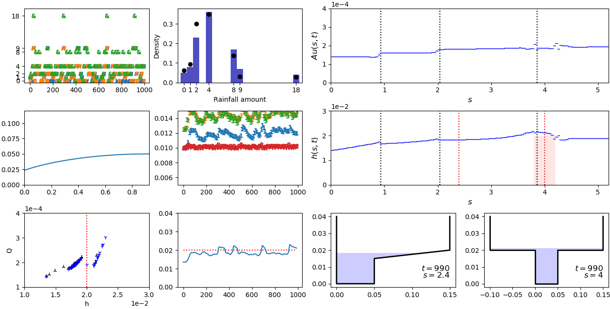

# hydraulic_wetro: python3 code


<!--  -->


<!--
---
## Contents

* [Introduction](#introduction)
  * [Motivation](#motivation)
  * [Description](#A-brief-description-of-Wetropolis)
  * [Taster](#taster)
  * [References](#references)
* [Getting started](#getting-started)
* [Code overview](#files-overview)
  * [MATLAB](#matlab)
  * [Python](#python)
* [Preliminary simulations](#preliminary-simulations)
---
 -->

## Files overview

File/dir name                   |  Summary
:--------------------------:|:--------------------------:
```main_wetro_tests.py```         | Main run script for test cases
```main_wetro_fullsyst.py```    | Main run script for full system: 1st implementation
```main_wetro_fullsyst_save.py```    | As above but cleaned up and saves data
```init_cond.py```              | Initial condition functions
```flux_function.py```          | Numerical flux calculation for space discretisation
```cross_sections.py```         | Compute cross-sections h(A,s) and A(h,s)
```plot_wetro.py```             | Very basic plotting routine for data generated in ```main_wetro_tests.py```
```plot_wetro_fullsys.py```     | Plotting routine for data generated in ```main_wetro_fullsys_save.py```
```plot_wetro_anim.py```             | Plotting routine (animation) for data generated in ```main_wetro_tests.py```
```plot_wetro_amp.py```             | Plotting routine (interactive animation) for data generated in ```main_wetro_tests.py```
```random_rainfall.py```     | Test script for generating and plotting random rainfall
```/configs```                  | Dir for config files:
```/configs/config#0.py``` etc. | Parameters for steady state test case
```/configs/config#1.py``` etc. | Parameters for flood wave test case
```/configs/config#2.py``` etc. | Parameters for full system


## Runninng the code

### Steady state test case

There exists a non-trivial steady-state solution of the St. Venant system: flow initialised with constant depth h (and hence cross-sectional area A) and so-called kinematic velocity u, together with the corresponding kinematic inflow and outflow boundary conditions, is both space- and time-dependent. This test case checks that the space-discretised DG0 (finite-volume) numerical scheme preserves this non-trivial steady state solution numerically. An analytical proof is given in Kent and Bokhove (2020).

* run ```main_wetro_tests.py``` with ```config#0.py``` specified as ```spec```. This saves data in the dir  ```/configs/config#0```.
* run plotting routine ```plot_wetro_amp.py```, again with ```config#0.py``` specified as ```spec```. This produces a live interactive plot (play/pause toggle with slider) and saves the output (below) as a gif (non-interactive).


### Flood wave test case
This builds on the steady-flow test case: flow is initialised with constant depth h (and hence cross-sectional area A) and kinematic velocity u; at the left (inflow) boundary, a time-dependent Gaussian pulse travels into the domain and floods the plains and city area. This 'floodwave' passes out of the domain and river levels recede to leave the steady flow solution.

* run ```main_wetro_tests.py``` with ```config#1.py``` specified as ```spec```. This saves data in the dir  ```/configs/config#1```.
* run plotting routine ```plot_wetro_amp.py``` again with ```config#1.py``` specified as ```spec```. This produces a live interactive plot (play/pause toggle with slider) and saves the output (below) as a gif (non-interactive).


### Full system: initial implementation
Numerical integration of full system: river channel (St Venant PDE), canals (mass ODE), reservoir (mass ODE), and moor (groundwater model PDE), coupled appropriately using hydraulic weir relations.

* run ```main_wetro_fullsys_save.py``` with ```config#2.py``` specified as ```spec```. This saves data in the dir  ```/configs/config#2```.
* run either (i) plotting routine ```plot_wetro_fullsys.py``` or (ii) video maker ```mov_wetro_fullsys.py```) again with ```config#2.py``` specified as ```spec```. Loads saved data ```config#2.npz``` and either (i) plots or (ii) saves a video of the Wetropolis dashboard. Snapshot at t= 990s above; animated gif below.

*NOTE: ```mov_wetro_fullsys.py``` requires the Python movie writer ```ffmpeg```. [Conda installation](https://anaconda.org/conda-forge/ffmpeg) is easiest; alternatively try [pip install](https://pypi.org/project/ffmpeg-python/) from terminal.*


Panel description: from top left to bottom right.
* Rainfall amount (rate), as a function of time, in the reservoir (orange R), moor (blue M), and both (res+moor; green &). Possible amounts are (0,1,2,4,8,9,18)r_0 where r_0 is a unit rainfall rate with probabilities given in the pdf (see Bokhove et al. 2020 for more details).
* Sample pdf of daily rainfall (time-dependent blue bars). The theoretical pdf is denoted by the black spots.
* River flow Au(s,t) along the channel s. The vertical black dotted lines correspond to the reservoir, moor, and canal inflows at s = 0.932m, 2.038m, and 3.858m, respectively. Note the jumps after the inflows.
* The water level h_m in the moor, as a function spatial moor coordinate y and time t, determined by a groundwater (nonlinear diffusion) model. The time-dependent left boundary is coupled to the river and canal.  Right boundary: solid wall. Rainfall is spatially uniform.
* Canal (1,2,3) and reservoir (R) levels as a function of time.
* Water depth h(s,t) along the channel s. The vertical black dotted lines correspond to the reservoir, moor, and canal inflows at s = 0.932m, 2.038m, and 3.858m, respectively. The red shaded area denotes the city region. The vertical red dotted lines are the locations of the cross-channel profiles in the panels below.
* Stage-discharge (h-Q) relationship in the city region. Black upward-pointing symbols denote rising water level; blue downward-pointing symbols denote falling water level.
* River level time series (blue) in the city region downstream of the canal inflow. The threshold for flooding is 0.02m (horizontal red dotted line).
* Cross-channel snapshots of river levels just downstream of the moor inflow (floodplain; corresponding to the left dotted red line in the above panel).
* Cross-channel snapshots of river levels just downstream of the canal inflow (city; ; corresponding to the right dotted red line in the above panel).

### Next steps: ensemble (in parallel) river component.

...
